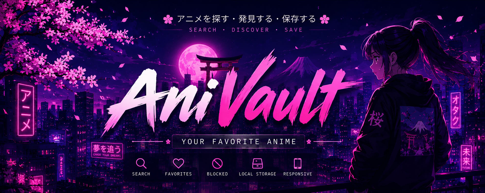

<div align="center">

# 🎌 AniVault

### *Search • Discover • Save Your Favorite Anime*



<br>


</div>

---

## ✨ Features

- 🔍 Search anime
- ❤️ Add and remove favorites
- 🚫 Block anime
- 💾 Local Storage
- 📱 Responsive design

---

## 🛠 Tech Stack

<p align="center">


</p>

---

## 🚀 Installation

```bash
git clone https://github.com/joshikata/anivault.git
cd anivault/anivault
npm install
npm run dev
```

---

## 🌐 Deploy

Production URL (Vercel):

- https://anivault-umber.vercel.app

---

## 👩‍💻 Author

**Fernanda**

GitHub → https://github.com/joshikata
